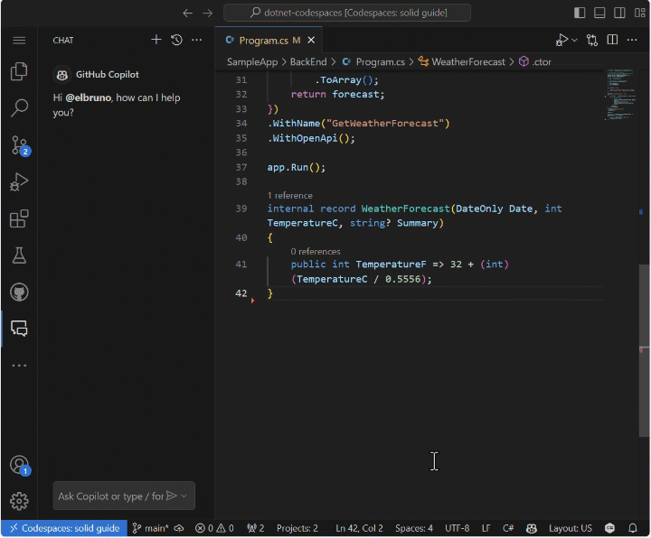
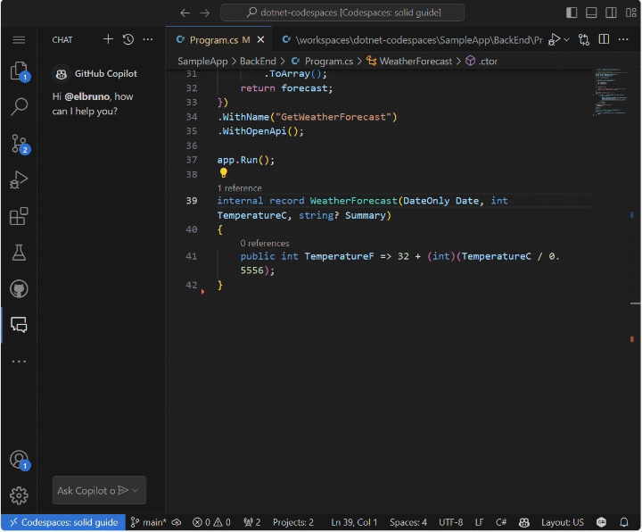
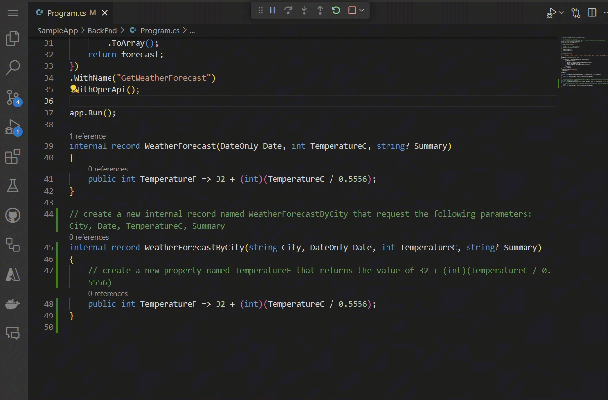
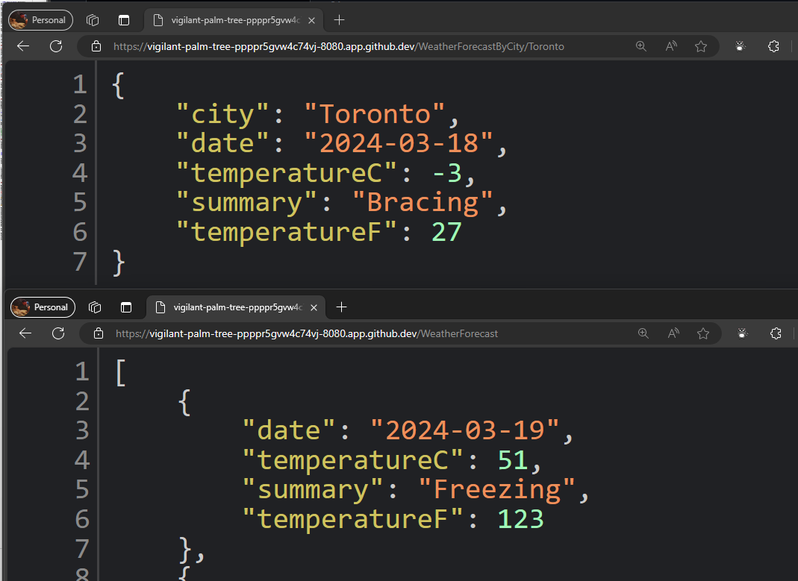
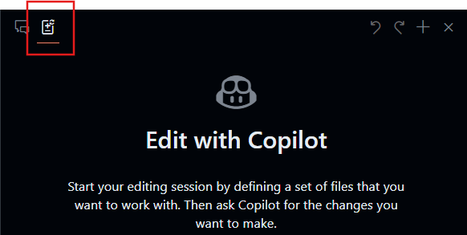
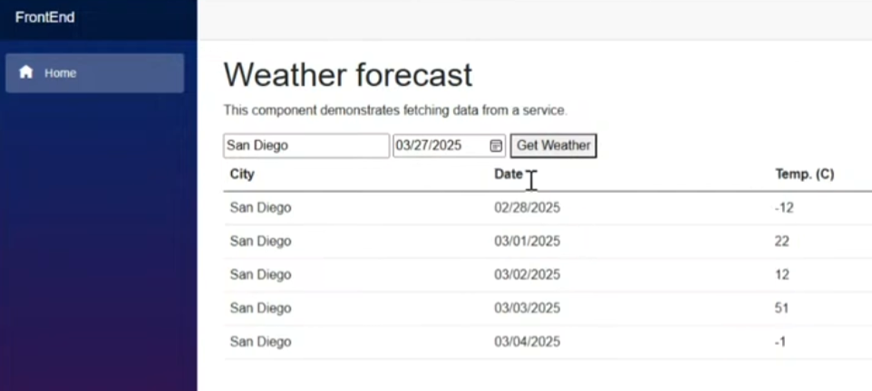

<header>

# Usando GitHub Copilot com C#

O GitHub Copilot é a primeira ferramenta de desenvolvedor de IA em larga escala projetada para revolucionar a codificação, fornecendo sugestões inteligentes no estilo de autocompletar enquanto você escreve. Neste módulo, exploraremos como aproveitar o GitHub Copilot para aumentar sua eficiência ao codificar em C#.

Como desenvolvedor, maximizar a produtividade e simplificar o processo de codificação são objetivos-chave. O GitHub Copilot serve como seu programador parceiro com IA, oferecendo sugestões contextuais adaptadas ao seu código. Ao final deste módulo, você aprenderá a configurar o GitHub Copilot no Codespaces e a aproveitar suas capacidades para gerar e implementar sugestões de código com facilidade.

Prepare-se para enfrentar um projeto prático e prático! Você trabalhará na modificação de um repositório C# para criar um endpoint de API usando o GitHub Copilot. Este exercício fornecerá uma experiência valiosa na construção de uma aplicação web C# que serve uma API HTTP e gera dados de previsão do tempo pseudo-aleatórios.

</header>


- **Para quem é isso**: Desenvolvedores, Engenheiros de DevOps, Gerentes de desenvolvimento de software, Testadores.
- **O que você aprenderá**: Como usar o GitHub Copilot para criar código e adicionar comentários ao seu trabalho.
- **O que você construirá**: Arquivos C# que terão código gerado pela IA do Copilot para sugestões de código e comentários.
- **Pré-requisitos**: O GitHub Copilot está disponível para uso gratuito, inscreva-se no [GitHub Copilot](https://gh.io/copilot).
- **Tempo**: Este curso pode ser concluído em menos de uma hora.

Ao final deste módulo, você adquirirá as habilidades para:

- Criar prompts para gerar sugestões do GitHub Copilot
- Aplicar o GitHub Copilot para melhorar seus projetos.

## Leitura pré-requisito:
- [Introdução à engenharia de prompts com GitHub Copilot](https://learn.microsoft.com/training/modules/introduction-prompt-engineering-with-github-copilot)

- [O que é a extensão GitHub Copilot para Visual Studio?](https://learn.microsoft.com/en-us/visualstudio/ide/visual-studio-github-copilot-extension?view=vs-2022)

## Requisitos

1. Habilite seu [serviço GitHub Copilot](https://github.com/github-copilot/signup)

1. Familiarize-se com [este repositório com Codespaces](https://github.com/github/dotnet-codespaces)

## 💪🏽 Exercício

**Clique com o botão direito no botão Codespaces a seguir para abrir seu Codespace em uma nova aba**
 
[](https://codespaces.new/Copilot-Workshop-Invillia/invillia-dotnet-acelerado)

O repositório "**GitHub Codespaces ♥️ .NET**" constrói uma API de Clima usando APIs Mínimas, abre o Swagger para que você possa chamar e testar a API e exibe os dados em uma aplicação web usando Blazor com .NET.


Revisaremos as etapas para atualizar o aplicativo Weather BackEnd adicionando um novo endpoint que solicita uma localização específica e retorna a previsão do tempo para essa localização.


### 🤔 Passo 0: Familiarize-se com o repositório "GitHub Codespaces ♥️ .NET"

Depois de abrir o repositório no Codespaces, você encontrará uma nova janela do navegador com um Codespace totalmente funcional. Tudo neste repositório está contido dentro deste único Codespace. Por exemplo, no painel do explorador, podemos ver o código principal do projeto BackEnd e FrontEnd.


Antes de executarmos o projeto, vamos usar o GitHub Copilot Chat para perguntar sobre o que é o projeto e os diferentes componentes.

1. Abra o **GitHub Copilot Chat** na barra de navegação principal.
1. Digite `O que este projeto está fazendo e quais são os componentes principais?` e clique em **Enviar***

O GitHub Copilot Chat agora analisará todo o projeto e nos dará um resumo do que os projetos fazem, quais tecnologias usam e quaisquer componentes principais neles.


A partir daqui, você pode clicar nos arquivos para navegar até eles e pode fazer perguntas de acompanhamento, como `Quais APIs estão disponíveis?`.


### 🚀 Passo 1: Execute os projetos

Agora que temos o contexto do que está no projeto, vamos executá-lo e vê-lo em ação.

Para executar o projeto BackEnd, vá para o painel "Executar e Depurar" e selecione o projeto "BackEnd".


Inicie a depuração do projeto selecionado. O projeto Weather API, nosso projeto BackEnd, agora estará sendo executado na porta 8080. Podemos copiar a URL publicada no painel *Portas*


> Nota: Quando você executa o aplicativo, verá a mensagem de erro "Esta página não está funcionando". Isso ocorre porque precisamos navegar até o endpoint, que está detalhado abaixo.

O aplicativo BackEnd publicou um endpoint chamado `weatherforecast` que gera dados de previsão aleatórios. Para testar o aplicativo em execução atual, você pode adicionar `/weatherforecast` à URL publicada. A URL final deve ser semelhante a esta

```bash
https://< sua url>.app.github.dev/weatherforecast
```
O aplicativo em execução em um navegador deve ser assim.


Agora vamos adicionar um ponto de interrupção em nosso aplicativo para depurar cada chamada à API. Vá para o arquivo `Program.cs` no projeto BackEnd. O arquivo está no seguinte caminho `SampleApp\BackEnd\Program.cs`. 

Adicione um ponto de interrupção na linha 24 (pressione F9) e atualize o navegador com a URL para testar o endpoint. O navegador não deve mostrar a previsão do tempo e, no Editor do Visual Studio, podemos ver como a execução do programa foi pausada na linha 24.


Pressionando F10, podemos depurar passo a passo até a linha 32, onde podemos ver os valores gerados. O aplicativo deve ter gerado valores de previsão do tempo para os próximos 5 dias. A variável `forecast` tem um array contendo esses valores.


Você pode parar a depuração agora.

Parabéns! Agora você está pronto para adicionar mais recursos ao aplicativo usando o GitHub Copilot.

### 🗒️ Passo 2: Familiarize-se com os Comandos de Barra do GitHub Copilot

À medida que começamos a trabalhar em nossa base de código, geralmente precisamos refatorar algum código ou obter mais contexto ou explicações sobre ele. Usando o GitHub Copilot Chat, podemos ter conversas orientadas por IA para realizar essas tarefas. 

Abra o arquivo `Program.cs` no projeto BackEnd. O arquivo está no seguinte caminho `SampleApp\BackEnd\Program.cs`. 

Agora vamos usar um comando de barra no GitHub Copilot para entender um trecho de código. Selecione as linhas 22-35, pressione `CTRL + I` para abrir o chat inline e digite `/explain`.


Com base na sua versão do GitHub Copilot, você verá uma resposta inline ou uma atualização no Painel de Chat. O GitHub Copilot criará uma explicação detalhada do código selecionado. Uma versão resumida será assim:

```
O código C# selecionado faz parte de um aplicativo ASP.NET Core usando o recurso de API mínima. Ele define um endpoint GET em "/weatherforecast" que gera um array de objetos WeatherForecast. Cada objeto é criado com uma data, uma temperatura aleatória e um resumo aleatório. O endpoint é chamado "GetWeatherForecast" e tem suporte OpenAPI para documentação padronizada da estrutura da API.
```

**Comandos de barra** são comandos especiais que você pode usar no chat para realizar ações específicas no seu código. Por exemplo, você pode usar: 
- `/doc` para adicionar um comentário de documentação 
- `/explain` para explicar o código 
- `/fix` para propor uma correção para os problemas no código selecionado 
- `/generate` para gerar código para responder à sua pergunta

Vamos usar o comando `/tests` para gerar testes para o código. Selecione as linhas 39-42, pressione `CTRL + I` para abrir o chat inline e digite `/tests` (ou selecione o comando de barra /tests) para gerar um novo conjunto de testes para este registro.



Neste ponto, o GitHub Copilot sugerirá uma nova classe. Você precisa primeiro pressionar [Aceitar] para criar o novo arquivo.

Uma nova classe `ProgramTests.cs` foi criada e adicionada ao projeto. Esses testes estão usando XUnit, no entanto, você pode pedir para gerar testes usando outra biblioteca de teste unitário com um comando como este `/tests use MSTests for unit testing`.

***Importante:** Não vamos usar o arquivo de teste neste projeto. Você deve excluir o arquivo de teste gerado para continuar.*

Finalmente, vamos usar o `/doc` para gerar documentação automática para o código. Selecione as linhas 39-42, pressione `CTRL + I` para abrir o chat inline e digite `/doc` (ou selecione o comando) para gerar a documentação para este registro.



O chat inline, o Painel de Chat e os comandos de barra fazem parte das ferramentas incríveis que suportam nossa experiência de desenvolvimento com o GitHub Copilot. Agora estamos prontos para adicionar novos recursos a este aplicativo.


### 🗒️ Passo 3: Gere um novo Registro que inclua o nome da cidade

Vá para o arquivo `Program.cs` no projeto BackEnd. O arquivo está no seguinte caminho `SampleApp\BackEnd\Program.cs`. 


Navegue até o final do arquivo e peça ao Copilot para gerar um novo registro que inclua o nome da cidade.

```csharp
// crie um novo registro interno chamado WeatherForecastByCity que solicita os seguintes parâmetros: City, Date, TemperatureC, Summary
```

O código gerado deve ser semelhante a este:

```csharp
// crie um novo registro interno chamado WeatherForecastByCity que solicita os seguintes parâmetros: City, Date, TemperatureC, Summary
internal record WeatherForecastByCity(string City, DateOnly Date, int TemperatureC, string? Summary)
{
    public int TemperatureF => 32 + (int)(TemperatureC / 0.5556);
}
```

Você pode ver o prompt funcionando na próxima animação:


### 🔎 Passo 4: Gere um novo endpoint para obter a previsão do tempo para uma cidade

Agora vamos gerar um novo endpoint de API semelhante ao `/weatherforecast` que também inclui o nome da cidade. O novo nome do endpoint da API será **`/weatherforecastbycity`**.

***Importante:** Você deve colocar o código após a linha '.WithOpenApi();', que começa na linha 36. Lembre-se também de pressionar TAB em cada nova linha sugerida até que todo o endpoint esteja definido.*

Em seguida, gere um novo endpoint com o GitHub Copilot adicionando o comentário: 

```csharp
// Crie um novo endpoint chamado /WeatherForecastByCity/{city}, que aceita um nome de cidade na URL como parâmetro e gera uma previsão aleatória para essa cidade
```
No exemplo a seguir, adicionamos algumas linhas em branco extras após o endpoint anterior e, em seguida, o GitHub Copilot gerou o novo endpoint. Uma vez que o código principal do Endpoint foi gerado, o GitHub Copilot também sugeriu código para o nome do endpoint (linha 49) e a especificação OpenAPI (linha 50). Lembre-se de aceitar cada uma dessas sugestões pressionando [TAB].



***Importante**: Este prompt gera várias linhas de código C#. É fortemente aconselhável verificar e revisar o código gerado para garantir que ele funcione da maneira desejada.*

O código gerado deve ser semelhante a este:

```csharp
// Crie um novo endpoint chamado /WeatherForecastByCity/{city}, que aceita um nome de cidade na URL como parâmetro e gera uma previsão aleatória para essa cidade
app.MapGet("/WeatherForecastByCity/{city}", (string city) =>
{
    var forecast = new WeatherForecastByCity
    (
        city,
        DateOnly.FromDateTime(DateTime.Now),
        Random.Shared.Next(-20, 55),
        summaries[Random.Shared.Next(summaries.Length)]
    );
    return forecast;
})
.WithName("GetWeatherForecastByCity")
.WithOpenApi();
```


### 🐍 Passo 5: Teste o novo endpoint.

Finalmente, verifique se o novo endpoint está funcionando iniciando o projeto no painel Executar e Depurar. 
Selecione Executar e Depurar e, em seguida, selecione o projeto BackEnd.


Agora pressione Executar e o projeto deve ser compilado e executado. Uma vez que o projeto esteja em execução, podemos testar a URL original usando sua URL do Codespace e o endpoint original:

```bash
https://< sua url do codespace >.app.github.dev/WeatherForecast
```

E o novo endpoint também estará pronto para ser testado. Aqui estão algumas URLs de amostra com diferentes cidades:
```bash
https://< sua url do codespace >.app.github.dev/WeatherForecastByCity/Toronto

https://< sua url do codespace >.app.github.dev/WeatherForecastByCity/Madrid

https://< sua url do codespace >.app.github.dev/WeatherForecastByCity/<NomeQualquerCidade>
```

Ambos os testes em execução devem ser assim:




🚀 Parabéns, durante o exercício, você não apenas usou o GitHub Copilot para gerar código, mas também fez isso de maneira interativa e divertida! Você pode usar o GitHub Copilot não apenas para gerar código, mas também para escrever documentação, testar suas aplicações e muito mais.

### ✨ Bônus: Adicione novas capacidades com GitHub Copilot Edits

Vamos usar **Copilot Edits** para iniciar uma sessão de edição de código com IA e iterar rapidamente nas alterações de código em vários arquivos usando linguagem natural. O Copilot Edits aplica as edições diretamente no editor, onde você pode revisá-las no local, com o contexto completo do código ao redor.

Vamos adicionar alguma nova funcionalidade para que o usuário possa inserir a cidade que deseja pesquisar e chamar nossa nova API.

1. Abra a janela **Edits** no GitHub Copilot Chat


2. Selecione o botão **+Add Files...** na janela Edits e adicione **FetchData.razor** e **WeatherForecastClient.cs**.
3. Digite no chat: `Atualize a interface do usuário para perguntar ao usuário a cidade que ele deseja o clima, use o cliente de previsão para chamar o novo endpoint para a cidade e atualize a tabela para exibir a cidade também.
4. Selecione o botão **Enviar** e agora o Edits gerará um plano de iteração para as alterações. 
5. Revise as edições e clique em **Aceitar** na janela de edições para aceitar todas as alterações nos arquivos.
6. Execute a aplicação

> Nota: Se a aplicação não executar ou não chamar o novo endpoint, valide as alterações nos arquivos alterados e certifique-se de que o endpoint está sendo chamado corretamente.



A partir daqui, você pode continuar a iterar e fazer perguntas sobre estilo ou outras funcionalidades para adicionar à aplicação.


## Avisos Legais

A Microsoft e quaisquer colaboradores concedem a você uma licença para a documentação da Microsoft e outros conteúdos
neste repositório sob a [Licença Pública Internacional Creative Commons Attribution 4.0](https://creativecommons.org/licenses/by/4.0/legalcode),
veja o arquivo [LICENSE](LICENSE), e concedem a você uma licença para qualquer código no repositório sob a [Licença MIT](https://opensource.org/licenses/MIT), veja o
arquivo [LICENSE-CODE](LICENSE-CODE).

Microsoft, Windows, Microsoft Azure e/ou outros produtos e serviços da Microsoft referenciados na documentação
podem ser marcas comerciais ou marcas registradas da Microsoft nos Estados Unidos e/ou em outros países.
As licenças para este projeto não concedem a você direitos de uso de quaisquer nomes, logotipos ou marcas comerciais da Microsoft.
As diretrizes gerais de marcas comerciais da Microsoft podem ser encontradas em http://go.microsoft.com/fwlink/?LinkID=254653.

Informações de privacidade podem ser encontradas em https://privacy.microsoft.com/en-us/

A Microsoft e quaisquer colaboradores reservam todos os outros direitos, seja sob seus respectivos direitos autorais, patentes,
ou marcas comerciais, seja por implicação, estoppel ou de outra forma.